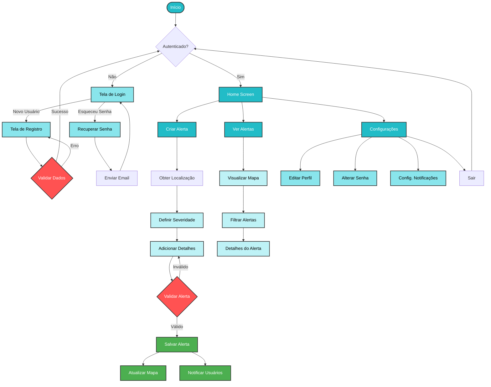

# Chents - Sistema de Alertas de Enchentes


## 📋 Sobre o Projeto

Chents é uma aplicação móvel desenvolvida para ajudar comunidades a se prevenirem e se manterem informadas sobre enchentes em suas regiões. O sistema permite que usuários criem e compartilhem alertas em tempo real sobre situações de alagamento, fornecendo informações cruciais para a segurança da população.

### Objetivo

O objetivo principal é criar uma rede colaborativa de informações sobre enchentes, permitindo que:
- Usuários reportem situações de alagamento em tempo real
- Comunidades recebam alertas sobre áreas afetadas
- Autoridades tenham acesso a dados precisos para ação rápida

## 👥 Equipe de Desenvolvimento

| Nome | RM | Papel |
|------|------|-------|
| Artur Lopes Fiorindo | 53481 | Frontend Developer |
| Eduardo Felipe Nunes Função | 553362 | Backend Developer |
| Jhoe Yoshio Kochi Hashimoto | 553831 | UX/UI Designer & Frontend Developer |

## Fluxograma do Sistema



## Tecnologias Utilizadas

### Frontend
- React Native
- Expo
- React Native Paper
- TypeScript
- Expo Location
- Expo Router

### Backend
- Firebase
- Firebase Authentication
- Cloud Firestore
- Firebase Cloud Functions

### Design
- Figma para prototipação
- Material Design guidelines

## Funcionalidades Principais

### 1. Autenticação
- Login com email e senha
- Registro de novos usuários
- Recuperação de senha
- Perfil do usuário personalizável

### 2. Gestão de Alertas
- Criação de alertas com:
  - Localização precisa via GPS
  - Nível de severidade (Baixo, Médio, Alto)
  - Descrição detalhada
  - Data e hora automáticas
- Visualização de alertas em mapa
- Filtros por região e severidade

### 3. Geolocalização
- Detecção automática de localização
- Reverse geocoding para identificação de endereços
- Mapa interativo com alertas

### 4. Interface do Usuário
- Design responsivo
- Modo claro/escuro
- Animações suaves
- Feedback visual em tempo real

## Paleta de Cores

```css
/* Cores Principais */
--primary-dark: #22bcc7;    /* Tom principal escuro */
--primary-medium: #89e5ec;  /* Tom intermediário */
--primary-light: #bef2f6;   /* Tom claro */

/* Cores de Severidade */
--severity-low: #4CAF50;    /* Verde - Baixo risco */
--severity-medium: #FFC107; /* Amarelo - Médio risco */
--severity-high: #FF5252;   /* Vermelho - Alto risco */
```

## Instalação e Execução

1. Clone o repositório
```bash
git clone https://github.com/seu-usuario/chents.git
```

2. Instale as dependências
```bash
cd chents
npm install
```

3. Configure as variáveis de ambiente
```bash
cp .env.example .env
# Edite o arquivo .env com suas configurações
```

4. Execute o projeto
```bash
npm start
```

## 📄 Licença

Este projeto está sob a licença MIT. Veja o arquivo [LICENSE](LICENSE) para mais detalhes.

## Contribuição

1. Faça um Fork do projeto
2. Crie uma Branch para sua Feature (`git checkout -b feature/AmazingFeature`)
3. Faça o Commit das suas mudanças (`git commit -m 'Add some AmazingFeature'`)
4. Faça o Push para a Branch (`git push origin feature/AmazingFeature`)
5. Abra um Pull Request


## Agradecimentos

- FIAP pelo suporte e infraestrutura
- Professores e orientadores
- Comunidade open source
- Todos os contribuidores do projeto

---
